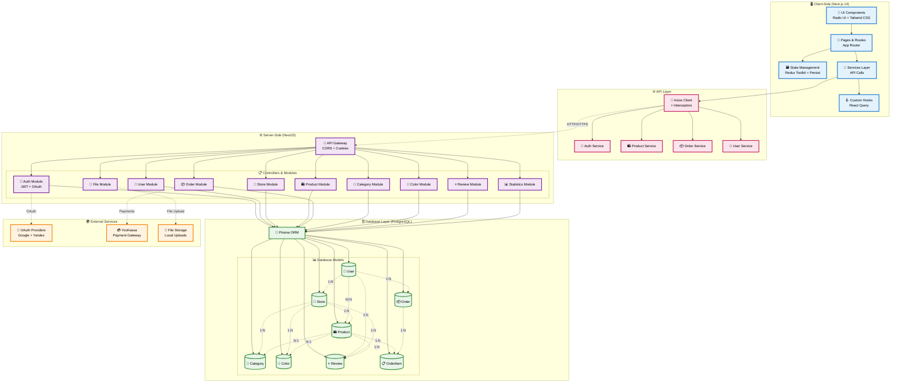

# Документация проекта

## Обзор проекта
Wander Wonder WoW
Этот проект представляет собой полнофункциональное приложение, созданное с использованием Next.js для клиентской части и NestJS для серверной части. Его цель — предоставить эффективное и масштабируемое решение для управления пользовательскими взаимодействиями и данными.

## Лицензия

Этот проект лицензирован по лицензии **ExtremXil Best License Yield Again (EBLYA)**.

### Условия лицензии:
- ✅ **Вы бесплатно пишете код и гордитесь собой.**
- ✅ **Я беру ваш код, пихаю рекламу и забираю все деньги.**

Выгодно и справедливо! Всё по заветам капитализма и open source одновременно.
Ваш вклад поможет мне стать богаче, а вы получите удовольствие от процесса.
Добро пожаловать в настоящее Open Source-сообщество.

### Запуск приложения:
```bash
# Backend:
$ cd /server-side
$ npm install
$ npm run start:dev

# Frontend:
$ cd /client-side
$ npm install
$ npm run dev
```
### Архитектура проекта:



## Поддержка и контактная информация
- **Автор**: [Ximelay](https://t.me/Ximelay_y)
- **Автор**: [Diablo_max](https://t.me/Ne_otmechai_menya_pishi_menegeru)
